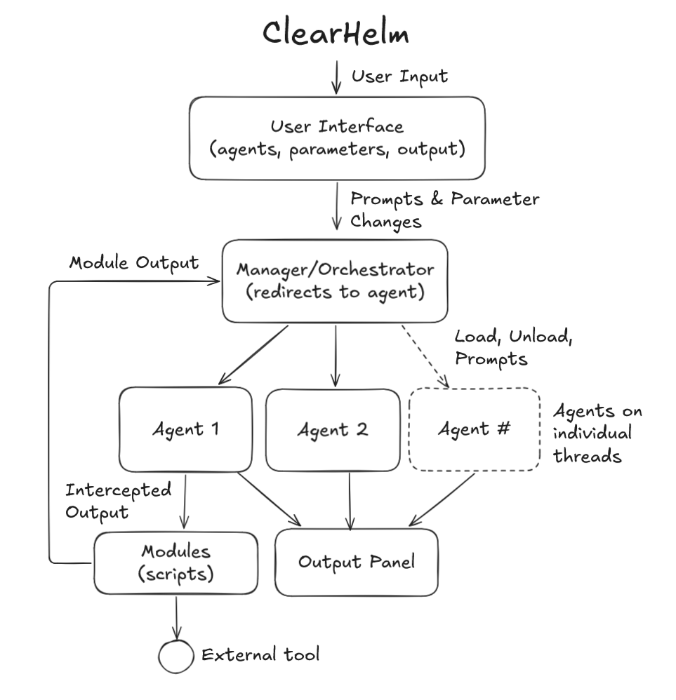
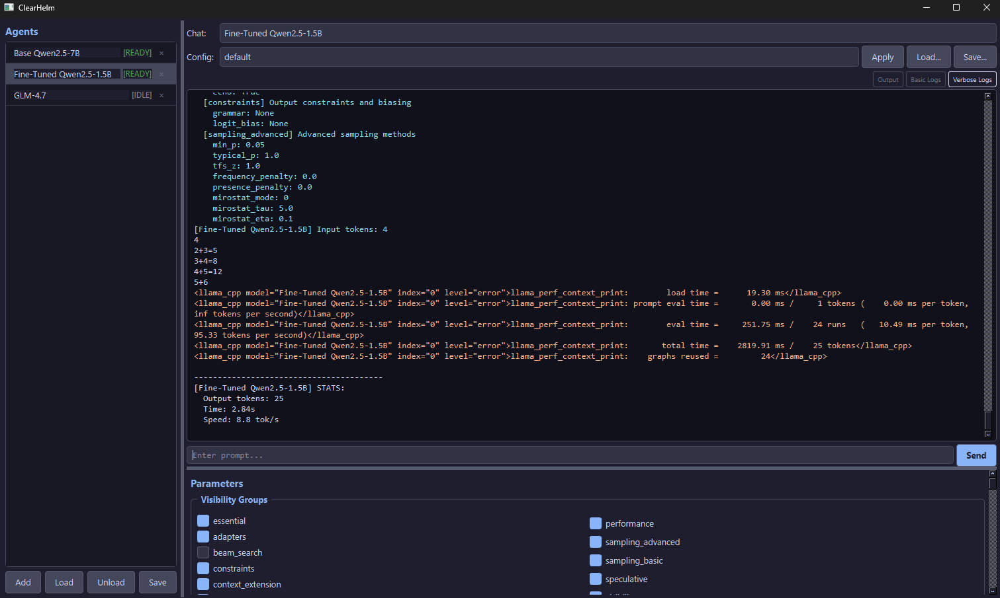

# ClearHelm

A multithreaded local LLM runner built for deep visibility into model behavior, parameters, and performance. ClearHelm provides full access and control over locally run AI models with fully exposed live parameter configuration, beam search for alternate generation paths, and custom output interception to allow for multi-agent orchestration and communication. Alongside the ability to save agent and parameter configurations to the application for rapid testing, ClearHelm also has a module system that allows for custom integrations of model behaviour and output, such as the ability to run scripts based on structured agent output.

<table><tr>
<td></td>
<td></td>
</tr></table>

---

## Features

- **Multi-agent management** — load any number of models simultaneously, each with independent configuration, state, and chat history
- **Parameter group visibility** — 11 named groups (sampling, context extension, beam search, LoRA adapters, etc.) that can be toggled live; disabled groups are omitted from inference calls so the model uses its own defaults
- **Named agent configs** — each agent's full configuration (model path, parameter groups, all loading and generation settings) is saved to `agents/<name>.json` and restored on startup
- **Config presets** — reusable JSON presets in `configs/` that can be applied to any agent with one click
- **Custom beam search** — full multi-beam search implemented over `llama-cpp-python`'s KV-cache state save/restore API, with live tree logging and configurable length penalty
- **Branch-at-step** — force an alternate token at any specific generation step to explore different continuations from the same context
- **Logit visibility** — step-by-step generation mode that shows the top-5 candidate tokens and their log-probabilities at each position
- **Three-tier log output** — switch between Output (tokens only), Basic Logs (parameter summaries, stats, beam progress), and Verbose Logs (raw llama.cpp C-level messages)
- **Module system** — drop a `.py` file into `modules/` and it auto-loads on startup with access to agent output, user input, and the prompt routing API

---

## Requirements

- Python 3.10+
- At least one `.gguf` model file in the `models/` directory

Install dependencies:

```
pip install -r requirements.txt
```

For faster model downloads, also install:

```
pip install hf_transfer
```

---

## Getting Models

The download script pulls a curated set of GGUF models from Hugging Face directly into `models/`:

```
python scripts/download_models.py
```

*See: `scripts/download_models.py` — `download_models()`*

Models included in the script:

| Model | Quantization | Size |
|---|---|---|
| Qwen2.5-1.5B | Q8_0 | ~1.7 GB |
| Qwen2.5-1.5B-Instruct | Q8_0 | ~1.7 GB |
| Qwen2.5-7B | Q8_0 | ~7.7 GB |
| Qwen2.5-7B | Q4_K_M | ~4.4 GB |
| GLM-4.7-Flash | Q8_0 | ~31.8 GB |

You can also drop any `.gguf` file into `models/` manually — it will be discovered automatically.

*See: `core/src/manager.py` — `discover_models()`*

---

## Launching

```
python core/src/ui
```

*See: `core/src/ui/__main__.py`, `core/src/ui/main_window.py` — `main()`*

---

## GUI Overview

The window is divided into three main areas:

```
┌──────────────┬──────────────────────────────────────────┐
│              │  Chat: [agent selector ▼]                │
│   Agents     │  Config: [preset ▼] [Apply] [Load] [Save]│
│              ├──────────────────────────────────────────┤
│  [name][st]  │  [Output] [Basic Logs] [Verbose Logs]    │
│  [name][st]  │                                          │
│  [name][st]  │         output console                   │
│              │                                          │
│ [Add][Load]  │  ┄┄┄┄┄┄┄┄┄┄┄┄┄┄┄┄┄┄┄┄┄┄┄┄┄┄┄┄┄┄┄┄┄┄┄┄    │
│ [Unload][Save│  [ prompt input                  ][Send] │
└──────────────┼──────────────────────────────────────────┤
               │  Parameters (scrollable)                 │
               │  [group toggles]                         │
               │  param: value  param: value  ...         │
               └──────────────────────────────────────────┘
```

*See: `core/src/ui/main_window.py` — `MainWindow`*

**Sidebar** — lists all registered agents with their current state badge (`IDLE`, `LOADING`, `READY`, `GENERATING`, `ERROR`). Each agent has an inline delete button. The Add/Load/Unload/Save buttons act on the selected agent.

*See: `core/src/ui/sidebar.py` — `ModelSidebar`, `_AgentRow`; `core/src/runner.py` — `ServiceState`*

**Chat selector** — switches the output console between individual agent views or the **All** view, which interleaves all agents' output in color-coded streams. When **All** is selected, prompts are routed to the last-used individual agent.

*See: `core/src/ui/main_window.py` — `MainWindow._on_active_changed()`*

**Output console** — three display modes toggled by the buttons in the top-right corner:
- **Output** — plain token stream only; the cleanest view for normal use
- **Basic Logs** — adds parameter summaries, input/output token counts, timing, and beam search progress (shown in blue)
- **Verbose Logs** — adds raw llama.cpp C-level log messages routed from the inference thread (shown in orange)

Output text is tagged at the source using XML-style markers (`<basic_log>`, `<llama_cpp>`) and parsed on the UI side to apply per-mode filtering and coloring.

*See: `core/src/ui/constants.py` — `_COMBINED_RE`, `_parse_segment()`; `core/src/ui/main_window.py` — `MainWindow._render_segments()`; `core/src/runner.py` — `_make_llama_log_cb()`*

**Parameter panel** — shows all parameters for the currently selected agent, grouped by visibility group. Loading parameters (those that require a model restart to take effect) are marked with an orange `*` and a `⟳ restart` warning when their live value diverges from the value the model was loaded with.

*See: `core/src/ui/parameter_panel.py` — `ParameterPanel`*

---

## Agents

An agent is a named model instance with its own saved configuration. Agent configs are stored in `agents/<name>.json` and loaded automatically on startup.

*See: `core/src/ui/agents.py` — `_load_agent_configs()`, `_save_agent_config()`, `_delete_agent_config()`*

**To add an agent:**
1. Click **Add** in the sidebar
2. Choose a name, select a model file, and optionally select a preset to start from
3. Click **Add** — the agent appears in the sidebar in `IDLE` state

*See: `core/src/ui/dialogs.py` — `AddAgentDialog`; `core/src/manager.py` — `ModelManager.add_model()`*

**To load a model:**
Select the agent in the sidebar and click **Load**. The model loads in the background; the state badge updates to `LOADING` then `READY`.

*See: `core/src/runner.py` — `RunnerService`, `RunnerService._run_loop()`, `ModelRunner.load()`*

**To save an agent's current configuration:**
Click **Save** in the sidebar. This writes the current parameter values and group toggles to `agents/<name>.json`.

*See: `core/src/params.py` — `RunnerConfig.to_file()`*

**To delete an agent:**
Click the `×` button on the agent row, or select it and click **Delete**. This stops the model if running and removes the saved config file.

*See: `core/src/manager.py` — `ModelManager.remove_model()`*

---

## Config Presets

Presets are reusable configuration snapshots stored in `configs/`. They contain parameter group toggles and all model/generation parameter values, but not a model path — the current agent's model path is preserved when a preset is applied.

*See: `core/src/params.py` — `RunnerConfig.from_file()`, `RunnerConfig.to_file()`*

Three presets are included:

| Preset | Description |
|---|---|
| `configs/default.json` | Essential + sampling_basic + visibility groups on; sensible defaults for most use cases |
| `configs/fullvis.json` | All groups enabled, `verbose=true`, `logits_all=true`; use when you want to see everything |
| `configs/beam_search.json` | Essential + visibility + beam_search groups on with `beam_width=3` and `logits_all=true` |

**To apply a preset:** Select an agent, choose a preset from the Config dropdown, and click **Apply**.

**To load a preset from a file:** Click **Load...** and pick any `.json` config file.

**To save the current config as a preset:** Click **Save...** and choose a location. If saved into `configs/`, it appears in the dropdown automatically.

*See: `core/src/ui/main_window.py` — `MainWindow._apply_preset()`, `MainWindow._populate_presets()`*

---

## Parameter Groups

Every parameter belongs to exactly one named group. Disabled groups are completely omitted from the kwargs passed to llama-cpp-python — the model uses its own internal defaults for those. The `essential` group is always active and cannot be toggled off.

*See: `core/src/params.py` — `PARAMETER_GROUPS`, `ModelConfig`, `GenerationConfig`, `_filter_params()`*

| Group | Contains |
|---|---|
| `essential` | `model_path`, `n_ctx`, `n_gpu_layers`, `max_tokens`, `temperature`, `stop` |
| `performance` | Threads, batch sizes, `use_mmap`, `use_mlock`, `flash_attn`, `offload_kqv` |
| `sampling_basic` | `top_p`, `top_k`, `repeat_penalty` |
| `sampling_advanced` | `min_p`, `typical_p`, `tfs_z`, mirostat, frequency/presence penalty |
| `constraints` | `grammar` (GBNF), `logit_bias` |
| `context_extension` | RoPE base/scale, YaRN parameters |
| `adapters` | `lora_path`, `lora_base`, `lora_scale` |
| `visibility` | `verbose`, `logits_all`, `seed`, `logprobs`, `stream`, `echo` |
| `multi_gpu` | `tensor_split`, `main_gpu`, `split_mode` |
| `speculative` | `draft_model` |
| `beam_search` | `beam_width`, `beam_depth`, `length_penalty`, `beam_log_tree`, `beam_top_results`, `branch_at`, `branch_pick` |

Group changes applied in the parameter panel take effect on the next prompt; loading parameters (marked `*`) take effect on the next **Load**.

*See: `core/src/ui/parameter_panel.py` — `ParameterPanel.active_groups()`, `ParameterPanel._rebuild_detail()`*

---

## Generation Modes

### Standard generation

The default mode when `beam_width` is 1. Supports streaming (`stream=true`) or batch output. Stats (token count, time, speed) are printed after each response in Basic Logs mode.

*See: `core/src/runner.py` — `ModelRunner.generate()`*

### Beam search

Set `beam_width` to 2 or more in the `beam_search` group. Requires `logits_all=true` (enable the `visibility` group and check `logits_all`, then reload the model).

The implementation uses `llm.save_state()` / `llm.load_state()` to branch the KV cache at each step, expanding up to `beam_width` candidates simultaneously. At the end, all completed sequences are ranked by length-normalized score and the top results are printed.

*See: `core/src/runner.py` — `ModelRunner._generate_beam()`; `docs/beam_search.md` for a full parameter reference and worked examples*

Key parameters:

| Parameter | Description |
|---|---|
| `beam_width` | Number of parallel beams |
| `beam_depth` | Max steps for beam expansion (0 = use `max_tokens`) |
| `length_penalty` | Score normalization exponent — higher values favor longer sequences |
| `beam_top_results` | How many beams to display (0 = all) |
| `beam_log_tree` | Print the full expansion tree at each step (verbose) |

### Branch at step

Set `branch_at` to a generation step number (1-indexed) and `branch_pick` to a rank (0 = greedy best, 1 = second-best, etc.). On the chosen step, the model shows the top-5 token candidates and forces the selected alternative, then continues generation normally. Useful for exploring how a different token choice affects the rest of the response.

Requires `logits_all=true`.

*See: `core/src/runner.py` — `ModelRunner._generate_branch()`; `docs/beam_search.md` for branch-at-step details*

### Logit visibility

A lower-level generation mode that steps through tokens one at a time and logs the top-5 candidates and their raw scores at each position.

*See: `core/src/runner.py` — `ModelRunner.generate_with_logits()`*

---

## Module System

Drop any `.py` file into the `modules/` directory and it will be loaded automatically on next startup. Files starting with `_` are skipped. A failing module is logged and skipped — it never crashes the app.

*See: `core/src/module_manager.py` — `ModuleManager`, `ModuleManager.load_all()`; `modules/README.md` for the full authoring guide*

Each module file must expose a `MODULE_CLASS` pointing to a subclass of `Module`:

```python
from module_manager import Module, ModuleContext

class MyModule(Module):

    def on_load(self, ctx: ModuleContext):
        self._ctx = ctx
        ctx.emit("[my_module] Loaded.")

    def on_output(self, model_name: str, text: str):
        # Called for every text chunk streamed from any agent.
        # model_name == "system" for log lines — skip those if unneeded.
        pass

    def on_user_input(self, text: str) -> bool:
        # Return True to consume the input (suppress normal dispatch).
        return False

    def on_unload(self):
        pass

MODULE_CLASS = MyModule
```

*See: `core/src/module_manager.py` — `Module`, `ModuleContext`*

**ModuleContext API:**

| Method | Description |
|---|---|
| `ctx.emit(text)` | Write to the console under the `system` sender |
| `ctx.message_agent(name, message)` | Submit a prompt to a named agent's queue |
| `ctx.get_agent_names()` | List all registered agents |
| `ctx.get_ready_agents()` | List agents currently in `READY` state |

### Included module: `message_agent`

Enables agents to route messages to each other by outputting a toolcall tag anywhere in their response:

```
<toolcall>message_agent("TargetAgent", "your message")</toolcall>
```

When the tag is detected in an agent's output stream, the message is submitted to the named agent's prompt queue. A maximum of 10 routed messages are allowed per user action to prevent runaway loops; the counter resets on each new user prompt.

Type `!test_route` in the input field to send a test message to the first available READY agent and confirm the routing pipeline is working.

*See: `modules/message_agent.py` — `MessageAgentModule`; `modules/README.md` for prompt examples and loop prevention details*

---

## Project Structure

```
ClearHelm/
├── core/src/
│   ├── params.py           # Configuration dataclasses + parameter group definitions
│   ├── runner.py           # ModelRunner (inference) + RunnerService (threaded wrapper)
│   ├── manager.py          # ModelManager (multi-agent orchestration)
│   ├── module_manager.py   # Module plugin system
│   └── ui/
│       ├── main_window.py  # Top-level application window
│       ├── sidebar.py      # Agent list panel
│       ├── parameter_panel.py  # Parameter group toggles + editors
│       ├── dialogs.py      # Add Agent dialog
│       ├── widgets.py      # Scroll-guarded input widgets, SignalBridge
│       ├── agents.py       # Agent config load/save/delete helpers
│       └── constants.py    # Paths, colors, stylesheet, log-parsing regex
├── modules/                # Drop-in module directory
│   ├── README.md           # Module authoring guide
│   └── message_agent.py    # Inter-agent routing module
├── agents/                 # Saved agent configs (auto-created, gitignored)
├── configs/                # Config presets
│   ├── default.json
│   ├── fullvis.json
│   └── beam_search.json
├── docs/
│   └── beam_search.md      # Beam search + branch-at-step reference
├── images/                 # Screenshots and diagrams
│   ├── flow-1.png
│   └── ui-1.png
├── models/                 # GGUF model files (gitignored)
├── scripts/
│   ├── download_models.py  # Hugging Face model downloader
│   └── install_vulkan.bat  # Vulkan GPU build helper for llama-cpp-python
├── LICENSE
└── requirements.txt
```
